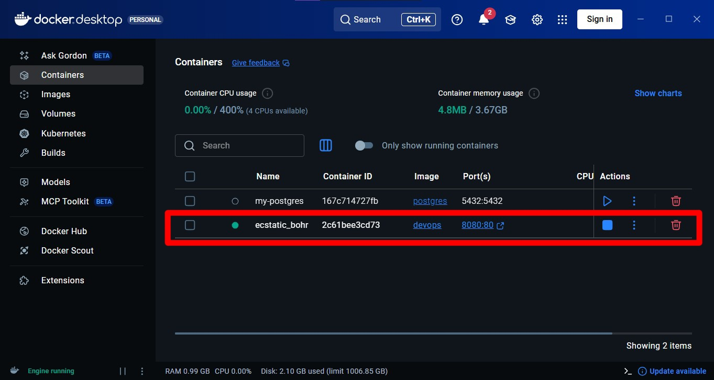
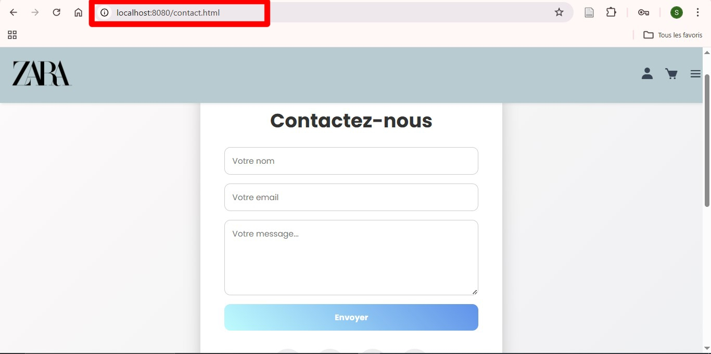
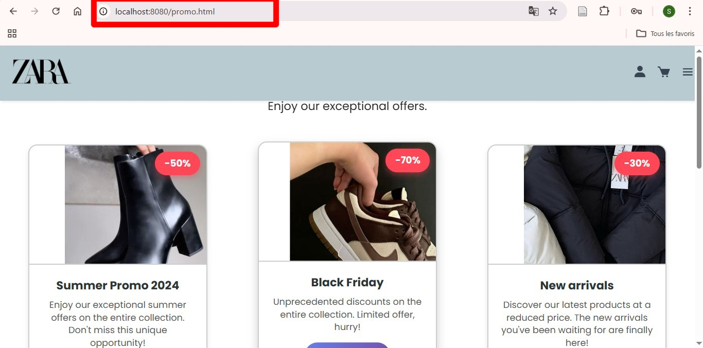

# Projet Site Web Zara

## Équipe du projet

- **Khoualed Meriem** - [@Aryem01](https://github.com/Aryem01)
- **Mehalli Nebia Safia** - [@safia203](https://github.com/safia203)
- **Sifodil Sarra** - [@SaraSF31](https://github.com/SaraSF31)
- **Tadlaouti Milad Meriem Zarga** - [@Meriem-md](https://github.com/Meriem-md)

## 1. Introduction

### 1.1 Présentation du projet

Le projet consiste en la création d'un site web pour la marque Zara, permettant aux utilisateurs de consulter et d'acheter des vêtements et des chaussures. Le site offre également une section pour découvrir les promotions et un formulaire de contact pour faciliter les échanges avec le service client. L'objectif principal est de fournir une expérience utilisateur simple, claire et attractive tout en mettant en valeur les produits et offres de la marque.

### 1.2 Objectifs réalisés

Offrir aux utilisateurs une plateforme pour découvrir et consulter les produits Zara (vêtements et chaussures), profiter des promotions, et contacter facilement le service client, le tout avec une navigation claire et un design moderne.

### 1.3 Technologies utilisées

- **HTML** : Structure et contenu des pages
- **CSS** : Mise en forme, design et style visuel
- **JavaScript (JS)** : Quelques fonctionnalités interactives simples

## 2. Le lien du dépôt

https://github.com/safia203/mini_zara_project

## 3. Méthodologie et étapes de réalisation du projet

### 3.1 Étapes de réalisation du projet

#### 1. Configuration initiale

Paramétrage des informations utilisateur sur la machine pour que tous les commits soient correctement enregistrés :

```bash
git config --global user.name "Safia"
git config --global user.email "mhsofia069@gmail.com"
```

#### 2. Création du dépôt local et initialisation

Création d'un dépôt Git local dans le dossier du projet.

Premier commit réalisé pour initialiser le projet :

```bash
git init
git add .
git commit -m "Initial commit"
```

#### 3. Ajout du dépôt distant et branche principale

Connexion du dépôt local au dépôt distant sur GitHub et configuration de la branche principale :

```bash
git remote add origin https://github.com/safia203/mini_zara_project
git branch -M main
git push -u origin main
```

#### 4. Organisation des fichiers du site

Placement de tous les fichiers du site (HTML, CSS, images…) dans un dossier dédié.

Vérification du bon fonctionnement du site en local.

#### 5. Déploiement sur GitHub Pages

##### 5.1 Configuration du workflow

Création du dossier `.github/workflows` et ajout du fichier `deploy.yml` pour automatiser la publication avec `peaceiris/actions-gh-pages`.

##### 5.2 Ajout, commit et push du workflow

```bash
git add .
git commit -m "Add deploy workflow for GitHub Pages"
git push
```

Voici le lien de capteur de réussie de pipeline:


#### 6. Ajout de l'interface promo.html, shoes.html et contact.html au dépôt Git

##### 6.1 Configuration de Git

Définir le nom et l'email de l'utilisateur :

```bash
git config --global user.name "Meriem-md"
git config --global user.email "tadlaoutimeriem607@gmail.com"
```

##### 6.2 Récupération du projet depuis GitHub

Cloner le dépôt distant :

```bash
git clone https://github.com/safia203/mini_zara_project
cd mini_zara_project
git pull origin main
```

##### 6.3 Ajout de la nouvelle page promo.html

Accéder au dossier contenant le site :

```bash
cd ZARA
```

Ouvrir et modifier le fichier si nécessaire :

```bash
code promo.html
```

Vérifier l'état du dépôt :

```bash
git status
```

Ajouter le fichier au suivi de Git et créer un commit :

```bash
git add promo.html
git commit -m "Ajout de promo.html"
```

##### 6.4 Mise à jour du dépôt distant

Revenir au dossier parent :

```bash
cd ..
```

Pousser les modifications vers GitHub :

```bash
git push origin main
```

##### 6.5 Vérifications finales

Consulter l'historique des derniers commits :

```bash
git log --oneline -5
```

Vérifier la configuration du dépôt distant :

```bash
git remote -v
```

**REMARQUE** : Cette même procédure est appliquée pour ajouter les autres interfaces : `shoes.html` et `contact.html`.

### 3.2 Containerisation avec Docker

#### Étape finale : Dockeriser le site web

Après avoir terminé la réalisation du site et l'avoir mis sur GitHub, nous avons créé un fichier `Dockerfile` permettant d'utiliser l'image Nginx comme serveur web et de copier les fichiers du site dans le dossier servi par Nginx. Ensuite, nous avons ajouté ce Dockerfile dans le dépôt GitHub.

#### 1. Création de l'image Docker

Commande utilisée :

```bash
docker build -t devops .
```

L'image a été créée avec succès.

#### 2. Lancement du conteneur

```bash
docker run -d -p 8080:80 devops
```

Lien de Capture de la création de l'image Docker :



#### 3. Tester le site dans le navigateur

Après avoir lancé le conteneur, le site est accessible à : http://localhost:8080

Voici les images utilisées pour prouver que le site fonctionne :







Ces captures montrent que toutes les pages du site s'affichent correctement à travers Docker.

### 3.3 Développement du site web

Création des pages principales :

- **Home** : vêtements (T-shirts, manteaux, trenchs, jeans…)
- **Shoes** : chaussures
- **Promo** : promotions et nouvelles arrivées
- **Contact** : formulaire avec nom, email et message

Mise en forme avec HTML/CSS et quelques interactions avec JavaScript.

## 4. Difficultés et solutions

### Erreur 1 : "src refspec main does not match any"

- **Cause** : Aucun commit initial
- **Solution** : Créer le premier commit avant le push

### Erreur 2 : Version incorrecte de l'action

- **Cause** : Utilisation d'une version non supportée de `peaceiris/actions-gh-pages`
- **Solution** : Modifier `deploy.yml` pour utiliser la version stable (v3)

### Erreur 3 : Workflow qui ne se lance pas

- **Cause** : Problème de permissions du workflow
- **Solution** : Activer les permissions Read and write pour le workflow

### Erreur 4 : 404 lors de l'ouverture du site

- **Cause** : Les fichiers étaient sur la branche main, alors que GitHub Pages cherchait le contenu sur la branche de publication
- **Solution** : Changer la branche de déploiement dans `deploy.yml` de main à gh-pages. Après cela, le site est correctement publié et le lien fonctionne

## 5. Conclusion

Le projet du site web Zara a permis de créer un site statique fonctionnel avec les pages Home, Shoes, Promo et Contact. Le site offre une navigation claire et un design moderne. Nous avons utilisé Git pour le versionnage et Docker pour la containerisation. Une pipeline CI/CD a été mise en place pour automatiser le déploiement. Ce projet a permis de consolider nos compétences en développement web et en gestion de projet.
